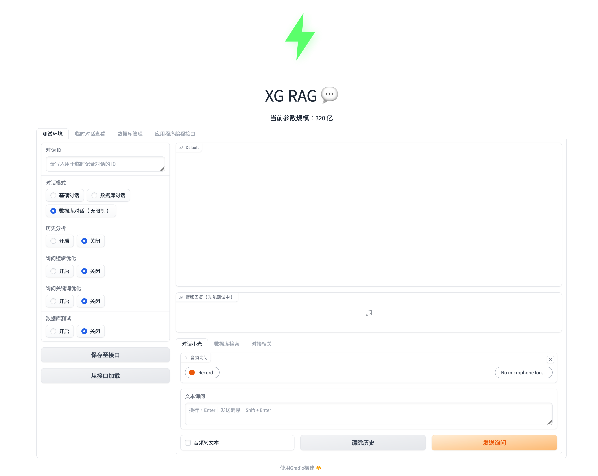
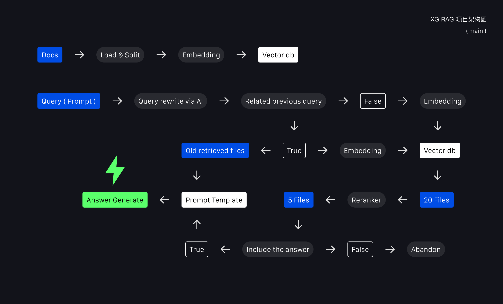

# XG RAG

> [!Note]
This project is made for chinese env, if your are not chinese user, will also work, but not easy to unstarand what it's meaning.

[版本信息](./packages/sources/version_info.md)

<details open="open">
<summary>大纲</summary>

- [项目简介](#项目简介-introduction-)
- [指引](#指引-guide-)
  - [首次部署](#首次部署-deploy-)
  - [启动、关闭、迁移](#启动关闭迁移-turn-on-or-off-transfer-)
- [数据库](#数据库-database-)
  - [维护和新增建议](#-markdown-维护和新增建议)
  - [如何测试新的数据库内容](#如何测试新的数据库内容)
  - [关于文件格式](#关于文件格式)
- [应用程序编程接口](#应用程序编程接口-api-)
- [基石项目](#基石项目-code-with-)

</details>

## 项目简介（ Introduction ）

<div>
  <p align="left">
    
  </p>
</div>

XG RAG 是基于 “LLM（ 大语言模型 ）、SWIFT（ 微调 & 驱动 ）、LangChain（ 框架 & API ）、Faiss（ 向量数据库 ）、Redis（ 历史对话 ）、vLLM（ 推理加速 ）、ASR（ 音频转文本 ）、TTS（ 文本转音频 ）、Gradio（ WebUI ）...” 编写的 RAG 应用。可用于绝大部分自然语言处理的任务，如 AI 客服、导购、知识库助理 ...，支持 API 调用。<br/>

主要推理流程如图所示：

<div>
  <p align="left">
    
  </p>
</div>

> [!Note]
RAG：检索增强型生成（ Retrieval Augmented Generation ）

1. 加载并拆分文档 → 存储至持久化向量数据库。
2. 发起询问 → 优化询问（ 提示词整段重写或关键词融合重写 ） → 是否可能与上轮询问相关（ 相关则额外获取上轮数据库取回至提示词模板中 ）→ 通过 Embedding 模型将询问转换为向量 → 匹配数据库并取回 → 通过 Raranker 模型对取回内容重新排序后压缩 → 取回中是否包含可能的答案（ 不可能则抛弃 ）→ 嵌入提示词模板 → 询问 LLM → 生成回答

> [!Note]
Prompt：在自然语言处理（ NLP ）中，提示词指用于引导模型生成响应的一段文本，本场景下即用户询问。

除上述外，还包含一些逻辑如：当取回为空时不再使用提示词模板；使用调度器对历史取回进行定时管理；支持语音输出语音回复 ...
更多细节请查看项目源代码或前往 WebUI 体验。

目前项目存在三种对话模式：基础对话、数据库对话、数据库对话（ 无限制 ）

- 基础对话：`无提示词模板` ；AI 的回复将不经过数据库取回这一步骤。
- 数据库对话：`含提示词模板` ；此模式下，当最终提示词内的数据库参考为空时（ 取回数据库时使用阈值 ），回复特定语句，可通过修改源代码的形式更改回复语句。
- 数据库对话（ 无限制 ）：`含提示词模板` ；数据库对话的无限制版本，当最终提示词内的数据库参考为空时（ 取回数据库时无阈值 ），对话模式临时变为 “基础对话”。

> 项目中大部份配置可通过 WebUI 修改。当前为了节约资源，杜绝测试和部署环境互相干扰，有关 API 的改动可能需要重启服务后生效。

## 指引（ Guide ）

以下将以 project_name 指代 “小写并替换空格” 版项目名（ xg_rag ）。

### 首次部署（ Deploy ）

> [!Warning]
GPU 至少使用两张，一张用于 LLM，一张用于 Embedding、Reranker 等小模型，
建议使用三张 4090，项目会自动检测显卡并进行划分（ 请根据模型占用显存自行控制硬件 ）。

> 建议使用 Docker

1 - 主机安装 NVIDIA Toolkit（ 移步查看 Dockerfile ）。

2 - 主机安装 Docker Engine（ 移步查看 Dockerfile ）后启动服务。

```bash
systemctl start docker
```

3 - 创建镜像：

```bash
git clone https://github.com/1100111GTH/XG-RAG.git
```
```bash
docker build -t project_name_img -f /path/project_name/Dockerfile /path/project_name
```

- `/path/project_name/Dockerfile` 是 `Dockerfile` 文件的路径。
- `/path/project_name` 是 `app` 、`packages` ... 的上级文件夹路径。
- 建议均使用绝对路径

4 - 创建并首次启动容器：

```bash
docker run -itd --name project_name --gpus all -p 2223:2222 -p 2032:2031 -p 7008:7007 -p 6007:6006 project_name_img
```

- `2222` 、`2031`、`7007` 、`6006` 分别是 SSH、LangServe、Arize Phoenix、Gradio 在 Docker 中的端口，对应的是主机中的映射端口（ 其中 Phoenix & Gradio 提供 Webui，进入 `127.0.0.1:端口` 网址即可访问服务 ）。

5 - 连接容器

```bash
docker attach project_name
```

- 如需暂离容器，非关闭，请使用快捷键 `Ctrl + p + q` 。

6 - SSH 连接容器，私钥在 `/project_name/packages/sources/keys` 文件夹中。

- 如使用仅 password 形式登陆，请提前查看并修改 `Dockerfile` `94` 段落。

7 - 下载对应模型（ 移步查看 Dockerfile 205 ~ 211 行 ）。

- 为了保证项目的易于管理性，请将模型放至 `/project_name/packages/model_weight` 下。
- 目前本项目建议使用的模型是：`LLM` [Qwen1.5-32B-Chat-AWQ](https://huggingface.co/Qwen/Qwen1.5-32B-Chat-AWQ) + `Embedding` [bge-large-zh-v1.5](https://huggingface.co/BAAI/bge-large-zh-v1.5) + `Reranker` [bge-reranker-v2-m3](https://huggingface.co/BAAI/bge-reranker-v2-m3) + `RSA` [whisper-large-v3](https://huggingface.co/openai/whisper-large-v3)。
  - 如切换其它 LLM 模型，可能需要针对现用模型进行 Prompt Template 上的优化，项目中部分功能是针对模型回复特定语句设计的，若推理结果出乎意料，会产生代码逻辑上的错误（ 切换前请优先查看 `/project_name/packages/core/api_call.py` 中关于 `prompt template` 相关代码）。
  - 这里建议的 LLM 模型依赖 [AWQ](https://github.com/mit-han-lab/llm-awq) 项目，效果似乎比 AutoGPTQ 好一些，如需使用，请查看官方 GitHub 存储库安装。
  - 部分量化版 LLM 还会使用 [AutoGPTQ](https://github.com/AutoGPTQ/AutoGPTQ) 量化项目，请查看官方 GitHub 存储库，并通过源码安装（ 目前非源码模式存在 Bug ）。
    - Tip：通过 pip3 install -e . 安装不会将源码复制到 site-packages，相反，只会创建一个 egg-link 指向链接，此模式可以更方便的在本地对包进行更改并及时同步，反之亦然。


8 - 微调大语言模型自我认知：

> 如使用的模型权重针对 System 提示词有做过优化，则可直接修改 System Prompt Template，输入相关信息，达到同样的效果。

1. 打开 `/project_name/packages/sources/cognitive_lora.ipynb` 。
2. 设置 `CUDA_VISIBLE_DEVICES` 环境变量（ 微调用到的显卡设备 ）。
   1. 建议在终端中使用 `nvidia-smi` 查看设备序列后修改。
3. 修改 `model_type` 为对应（ [SWIFT](https://github.com/modelscope/swift/tree/main) 支援 ）的 LLM 模型名称。
   1. 如果你使用的是 [VSCode 编辑器](https://code.visualstudio.com/)，可以 `Ctrl` or `Command + 点击` `ModelType` 去查看支援且对应的模型命名
   2. 查阅官方 github 也是可以的。
4. 修改关键字参数 `model_name` 、`model_author` 至希望的值。
5. 注意：
   1. 微调模型存在梯度，往往会比正常启动模型的显存占用更大一些。
   2. 不同的数据集对微调的影响较大，可能产生负面效果（ 遗忘 ）。即使数据集一致，每次微调的效果不一定完全一样，所以建议在得到一个较为满意的模型后保存复用。
6. 合并后的模型路径位于执行命令目录的 `output` 文件夹中。
7. 使用微调后的模型用于部署时，请不要忘记将新模型路径修改至 `config.py` 中。

9 - 数据库配置：

1. 为确保向量数据库正常初始化，请将提前将 Markdown 文件放至 `/project_name/packages/database` 中（ 仅可初始化单个 Markdown 文件 ）。
   1. 若您的初始化文件命名并非 `qa`，则请修改 `/project_name/packages/core/api_call,py` 第 `55` 行中关于数据库文件的命名。

10 - 最终配置：

1. 打开 `/project_name/packages/config/config.py` 。
2. 如需开启 HTTPS，请在 `ssl_keyfile` & `ssl_certfile` 处提供对应文件的路径（ 建议绝对路径 ）。
2. 修改 `llm_path` 、`embedding_path` 、`reranker_path` 为对应模型路径（ 建议绝对路径 ）。
3. 修改 `openai_api_model_name` 与先前 `model_type` 一样的模型名称，只不过 `"_"` 改为 `"-"` 。
4. `small_model_loadon` 是 Embedding & Reranker 模型的加载设备。为了防止显存溢出，本项目采取的策略是将它们单独加载到独立于 LLM 外的显卡上，通常是最后一张显卡。
   1. 可能会产生一些显存空置。

### 启动、关闭、迁移（ Turn On or Off, Transfer ）

启动：

```bash
systemctl start docker
```

```bash
docker start project_name
```

```bash
docker attach project_name
```

```bash
bash /project_name/launch_all.sh  # 一键启动 swift deploy、redis-server、langchain server、gradio ...
```

关闭：

```bash
exit  # 容器中输入
```
```bash
docker stop project_name  # 容器外输入
```

```bash
systemctl stop docker
```

迁移：

```bash
docker commit project_name project_name_img_1  # 将容器保存为镜像
```

```bash
docker save -o /path/project_name_img.tar project_name_img_1  # 将镜像保存本地（ /path/project_name_img.tar 为保存路径及文件名 ）
```

```bash
docker docker load -i /path/project_name_img.tar  # 新主机 Docker 载入（ 不要忘了在新主机上先启动 Docker 服务 ）
```

### 数据库（ Database ）

#### （ Markdown ）维护和新增建议：

> 为了展示效果，可以在部分需要换行的节点使用 `<br/>` 进行换行。

> 下方内容仅作于约定俗成的维护规范，不等于不遵守 AI 就无法获取信息，反之遵守后 AI 会更轻易的获取重点信息。

1. `降低理解难度`；鉴于不同的 AI 模型的理解力有不同的表现，且关注点可能不一致，请各位在编写数据库文本时越通俗易懂越好。
2. `仅用一级标题`；仅使用 Markdown 中的一级标题（ `# Title` ）作为 “问题”，正文作为 “解答”。
   - 若使用了更多级别（ `## SubTitle`、`### SubbTitle` ... ）的标题，可能会导致数据库信息取回后，AI 无法理解到多个标题的全部内容，只理解了与正文最接近的标题。
3. `精准描述`；由于 AI 的知识有限，且局限于训练时的数据集创建日期，新出的游戏内容、实时热点、容易产生歧义的上下文信息都可能造成 AI 无法给出满意的答复，或给出的额外答复不符合取回信息的基本事实，所以针对此类信息，建议在 QA 中添加一些关键词汇辅助 AI 进行判断。
   - 游戏没有声音怎么办 → 手机游戏没有声音怎么办
     - AI 在回复中可能会额外给出电脑游戏没有声音的解决方案。
   - NBA 2k23 xxx → 手机游戏 NBA 2k23 xxx
     - NBA 2k23 不仅在移动平台上可以游玩，主机及 PC 也可。AI 在回复中可能会额外给出一些不属于意向平台的回复。
4. `减少使用重复词汇`；更多的重复词汇可能会导致取回到错误信息的概率增加，即使在代码架构中已极力降低了此机率。建议在彼此不相关的 QA 内容上减少词汇的重叠。
5. 有的小伙伴可能会说 `精准描述` 与 `减少对重复词汇的使用` 两者相矛盾，这里建议 `精准描述` 需要在 `减少使用重复词汇` 的基础上完成，且无需过度纠结 `精准描述` 的执行程度，建议在新的数据库内容上线前多做测试，当 AI 出现了非预想的回复时，再去修改文本以纠正 AI 回复，也就是去完善 `精准描述`（ AI 的回复可以被数据库内容纠正 ）。
6. 由于数据库内容除了 AI 需要读取，小伙伴们可能也需要阅读。建议全文采用统一的编写习惯，混乱的编写内容，错误的中英文符号（ 半全角符号 ）混用都会一定程度增加理解的困难度。
   - 标点符号混用等小问题，AI 在理解时会自动纠正，但还是规范为好。
   - 具体编写习惯可以自行统一决定，不对 AI 增加理解负担即可。

#### 如何测试新的数据库内容？

1. 前往 WebUI。
2. 选择 “数据库” Tab，上传测试文件至 “Test”。
3. 前往 “测试环境” Tab，开启 “数据库测试” 功能。

> 注意！测试文件会在服务器关闭时丢失，请注意保存。
> 无论正式数据库或测试数据库，内容一旦删除，不可复原，请谨慎操作。

#### 关于文件格式

为了使数据库取回这一功能取得最好效果，现在仅开放了 Markdown 文件上传，但可以结合 [Unstructured](https://github.com/Unstructured-IO/unstructured) 项目针对所有的人类可读文件操作，如 text、json、pdf、jpg、png、excel ... ，因此类不如 Markdown 做到了结构上内容与内容间的明确区分（ 向量数据库内的信息需要进行划分 ），所以商用优先建议考虑 Markdown，而非其它格式（ 后续可能会考虑适配其它格式 ）。

### 应用程序编程接口（ API ）

前往查看 WebUI “应用程序编程接口” Tab 或 `/project_name/packages/sources/text_only.py` 的 `api_guid` 变量。

## 🤘🏻😉🤘🏻

欢迎各位提出新的功能需求，发掘 issue。<br/>
如果项目有帮助到您，请我喝一杯瑞幸如何？当然星巴克也是极好的～！

<div>
  <p align="left">
    
  </p>
</div>


## 基石项目（ Code With ）

> [!Warning]
此项目无任何商业使用限制，但内部涉及到的其它项目请自行检查对应 License。

<div>
  <p align="left">
    <a href="https://github.com/QwenLM/Qwen">
      
    </a>
    <a href="https://github.com/vllm-project/vllm">
      
    </a>
    <a href="https://github.com/langchain-ai">
      
    </a>
    <a href="https://github.com/gradio-app/gradio">
      
    </a>
    <a href="https://github.com/FlagOpen/FlagEmbedding">
      
    </a>
    <a href="https://github.com/Arize-ai/phoenix">
      
    </a>
  </p>
</div>

> 包括但不限于此，更多涉及项目请查看源代码


